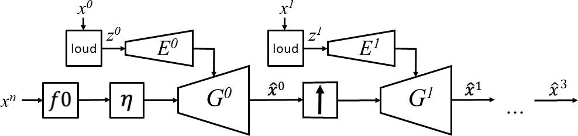

# Hierarchical Timbre-Painting and Articulation Generation

<a href="https://colab.research.google.com/github/mosheman5/timbre_painting/blob/master/timbre_painting.ipynb" target="_parent"></a>

This repository provides an official PyTorch implementation of "Hierarchical Timbre-Painting and Articulation Generation"

Our method generates high-fidelity audio for a target instrument, based f0 and loudness signal.

During training, loudness and f0 signal are extracted from ground-truth signal, 
which enables us to convert the melody of any input instrument to the trained instrument - task also known as Timbre Transfer

  [**Audio Samples**](https://mosheman5.github.io/timbre_painting/)
| [**Paper**](https://arxiv.org/abs/2008.13095)
| [**Pretrained Models**](#pretrained-models)
| [**Timbre Transfer Demo**](https://github.com/mosheman5/timbre_painting/blob/master/timbre_painting.ipynb)


We suggest seperating the generation process into two consecutive phases:
* Articulation - We generate the backbone of the audio and the transition between notes. 
This is done on a low sample rate from the given condition, loudness and f0 inputs. 
We use a sine excitation based on the extracted f0 signal, 
hence using the generator as a Neural-Source-Filtering network rather than a classic GAN generator which is condition on random noise.
* Timbre Painting - The next phase is composed of timbre painting networks: each network gets as input the previously generated audio and serves as a 
learnable upsample network. Each timbre-painting networks adds sample-rate specific details to the audio clip.



## Dependencies
The needed packages are given in ```requirements.txt```

Using a virtual enviroment is recommended:
```
virtualenv -p python3 .venv
source .venv/bin/activate
pip install -r requirements.txt
```
To use distributed runs, please install [apex](https://github.com/NVIDIA/apex)

## Usage

Hydra is used for configuration and experiments mangement, for more info refer https://hydra.cc/

### 1. Cloning the repository
```
$ git clone https://github.com/mosheman5/timbre_painting.git
$ cd timbre_painting
```
 
### 2. Data Preparation

#### URMP Dataset
To download the [URMP dataset](https://ieeexplore.ieee.org/document/8411155) used in our paper please fill the [form](https://docs.google.com/forms/d/e/1FAIpQLSdGQx4Q0G4yIT0WDj1cAlfcAq8VZNcV7ZGKqRj8ijgCOzd1lg/viewform)

After download extract the content of the file to a folder named ```urmp```
and run the following script to preprocess the data:
```
python create_data_urmp.py
```

#### Other datasets

To train the model on any other datasets of monophonic instruments, copy the audio files to ```data_tmp``` directory, 
each instrument in a different folder, and run:
```
python create_data_urmp.py urmp=null
```
Default parameters are given at ```conf/data_config.yaml```, overrides should be given in command line. 

Please note the default parameters are defined for URMP dataset, for other datasets tuning might be needed (especially the ```data_processor.params.confidence_threshold``` and ```data_processor.params.silence_thresh_dB``` parameters)

### 3. Training

To Train with the original paper's parameters run:
```
python main.py
```
Default parameters are given at ```conf/runs/main.yaml```, overrides should be given in command line. 

for example, the following line runs an experiment on a dataset folder named 'flute' for 400 epochs and batch_size of 4:
```
python main.py paths.input_data=data.flute optim.epochs=400 optim.batch_size=4
```

results are saved in the folder ```outputs/main/${%Y-%m-%d_%H-%M-%S}```

### 4. Timbre Transfer

To transfer the timbre of your files using a trained network, run:
```
python timbre_transfer.py trained_dirpath={path/to/trained_model} input_dirpath={path/to/audio_sample_folder}
```

Default parameters are given at ```conf/transfer_config.yaml```.

The generated files are saved in the experiment folder, in subdirectory ```generation``` 
Each input is generated in 5 versions with varying octave range from [-2, 2]

## Pretrained Models

Pretrained models of instruments from URMP dataset are summarazied in the table.
The models can be downloaded from the google drive links attached.
Download the model, extract and follow [timbre transfer](#4-timbre-transfer) to generate audio.

| Instrument
| :------ 
| [Violin](https://drive.google.com/uc?id=1KEodWMgtWLynBlMIZdSlIjGvrPJ2TpNQ&)
| [Saxophone](https://drive.google.com/uc?id=1GNL1yCdGmcxSGdECtpUb5BqbRWSeyB6b)
| [Trumpet](https://drive.google.com/uc?id=1SMJMnw7RorAymxQpoy_e2vUJlRH3Xmcy)
| [Cello](https://drive.google.com/uc?id=1Nx4sUznH1cWUvDOdQLFd-v7ZZKKwQWZu)


## Citation
If you found this code useful, please cite the following paper:
```
@inproceedings{michelashvili2020timbre-painting,
  title={Hirearchical Timbre-Painting and Articulation Generation},
  author={Michael Michelashvili and Lior Wolf},
  journal={21st International Society for Music Information Retrieval (ISMIR2020)},
  year={2020}
}
```

## Code References
- [kan-bayashi/ParallelWaveGAN](https://github.com/kan-bayashi/ParallelWaveGAN)
- [marl/crepe](https://github.com/marl/crepe)
- [magenta/ddsp](https://github.com/magenta/ddsp)
- [justinsalamon/melosynth](https://github.com/justinsalamon/melosynth)
- [facebookresearch/hydra](https://github.com/facebookresearch/hydra)

## Acknowledgement
Credit to Adam Polyak for PyTorch CREPE pitch-extraction implementation and helpful discussions.
